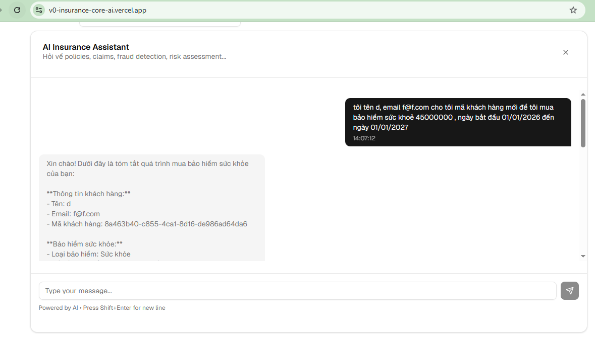

= Tầm Nhìn Doanh Nghiệp Đột Phá: AI-Powered Enterprise
:author: CineAI Assistant
:email: support@cineai.vn
:revnumber: 1.0
:revdate: April 21, 2026
:toc: left
:toclevels: 3
:icons: font
:sectnums:

:TEST: 
:"tôi tên d, email f@f.com cho tôi mã khách hàng mới để tôi mua bảo hiểm sức khoẻ 45000000 , ngày bắt đầu 01/01/2026 đến ngày 01/01/2027":

== I. Định nghĩa AI-Powered Enterprise

Một doanh nghiệp **"AI-Powered"** không chỉ đơn thuần là dùng ChatGPT để viết email. Đó là một tổ chức mà AI được nhúng sâu vào chuỗi giá trị, từ vận hành nội bộ đến trải nghiệm khách hàng, biến dữ liệu thành các hành động tự động và thông minh.

=== 1. Đối với Tập đoàn Sản xuất lớn
Để giải quyết thách thức về chuỗi cung ứng và tối ưu hóa sản xuất, doanh nghiệp cần thực hiện:

[cols="1,4", options="header"]
|===
| Bước | Hoạt động trọng tâm
| *01* | **Đánh giá & Lập Kế Hoạch**: Xác định các lĩnh vực lãng phí có thể cải thiện bằng AI.
| *02* | **Đào Tạo & Phát Triển**: Nâng cao năng lực sử dụng công cụ AI cho đội ngũ vận hành.
| *03* | **Tích Hợp Vận Hành**: Dự đoán nhu cầu, tự động hóa quy trình để giảm thiểu lãng phí.
| *04* | **Trải Nghiệm Khách Hàng**: Triển khai Chatbot 24/7 và cá nhân hóa trải nghiệm người dùng.
| *05* | **Đo Lường & Tối Ưu**: Cải thiện hiệu suất dựa trên dữ liệu thực tế (Data-driven).
| *06* | **Hệ thống ERP**: Đồng bộ hóa từ kho hàng đến tài chính để có cái nhìn tổng thể.
|===

=== 2. Đối với Tổ chức Tài chính & Ngân hàng
Tận dụng AI trong hệ thống ERP để tối ưu hóa quản lý tài nguyên:

* **Đánh giá hiện trạng**: Tìm điểm yếu trong quản lý tài chính và nhân sự.
* **Lập kế hoạch tích hợp**: Ứng dụng Machine Learning và xử lý ngôn ngữ tự nhiên (NLP).
* **Tự động hóa tài chính**: Dự đoán nhu cầu vốn và phân tích rủi ro khách hàng tự động.

=== 3. Đối với Công ty Dịch vụ & Chăm sóc Khách hàng
Tích hợp AI vào CRM để đa dạng hóa kênh tương tác (Phone, Email, Social Media):

[TIP]
====
AI-Powered trong dịch vụ không chỉ là công nghệ, mà là cách bạn tạo ra giá trị thực sự thông qua sự thấu hiểu khách hàng.
====

* **Phản hồi tức thì**: Sử dụng Chatbot và Voicebot để giải quyết vấn đề ngay lập tức.
* **Cá nhân hóa sâu**: Dự đoán nhu cầu dựa trên lịch sử tương tác để đưa ra gợi ý phù hợp.

=== 4. Đối với Ngành Bảo hiểm
Tích hợp AI vào quản lý rủi ro và quy trình nghiệp vụ lõi (Core Insurance):

. **Ứng dụng AI vào Core lõi**: Tự động hóa đánh giá rủi ro và quản lý yêu cầu bồi thường.
. **Đưa ra quyết định thông minh**: Tăng khả năng cạnh tranh nhờ định giá bảo hiểm linh hoạt (Dynamic Pricing).

== II. Các trụ cột cốt lõi (Core Pillars)

=== 1. Hệ thống dữ liệu (The Data Foundation)
[NOTE]
AI không thể thông minh nếu thiếu dữ liệu sạch. Đây là "nhiên liệu" cho mọi mô hình trí tuệ nhân tạo.

* **Knowledge Graph**: Kết nối dữ liệu rời rạc thành mạng lưới tri thức.
* **Vector Database**: Lưu trữ không gian vector phục vụ tìm kiếm ý nghĩa (*Semantic Search*).
* **Data Lake & Warehouse**: Nơi lưu trữ và chuẩn hóa dữ liệu từ nhiều nguồn khác nhau.
* **Data Governance & Security**: Đảm bảo an toàn, bảo mật và tuân thủ quyền riêng tư dữ liệu khách hàng.

=== 2. Trí tuệ nhân tạo (The Intelligence Layer)
[horizontal]
*Generative AI (LLMs)*:: Sử dụng các mô hình như **Llama 3** (qua Groq) để tóm tắt văn bản và sáng tạo nội dung.
*Predictive AI*:: Dự báo xu hướng thị trường, tồn kho dựa trên dữ liệu lịch sử.
*Agentic Workflows*:: Các "Agent" (như *Chat Assistant*) tự suy luận, gọi API và giải quyết tác vụ từ đầu đến cuối.

=== 3. Giao tiếp đa phương thức (Multimodal Interface)
Đây là cầu nối giữa con người và máy móc:

* [x] **Voice-to-Text & Text-to-Voice**: Phá bỏ rào cản qua giọng nói (STT/TTS).
* [x] **Computer Vision**: Nhận diện hình ảnh, khuôn mặt và kiểm soát chất lượng qua camera.

== III. Kết luận

Mô hình **AI-Powered Enterprise** giúp doanh nghiệp không chỉ dừng lại ở việc viết code, mà còn biết cách đóng gói các module công nghệ (**GraphRAG, TTS, LLM**) thành giải pháp có giá trị kinh tế thực sự. 

> *Hãy bắt đầu hành trình trở thành một doanh nghiệp "AI-Powered" ngay hôm nay để tận dụng tối đa tiềm năng của trí tuệ nhân tạo!*

[role="text-center"]
--
_Tài liệu được biên soạn bởi CineAI - Intelligent Film Assistant_
--
